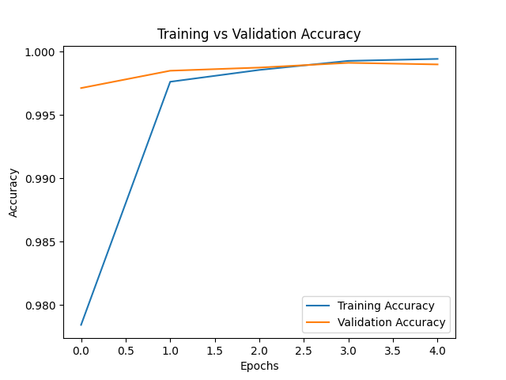

# Gesture Recognition using CNN

A Convolutional Neural Network (CNN) based gesture recognition system built from scratch using a custom dataset.

## Features
- Custom dataset collection and preprocessing
- CNN model training and evaluation
- Real-time gesture prediction
- Accuracy and performance visualization

## Results
- Achieved high training and validation accuracy
- Confusion matrix and classification report generated for evaluation

### Accuracy Curve

### Confusion Matrix

## Technologies Used
- Python
- TensorFlow / Keras
- OpenCV
- NumPy
- Matplotlib
- Scikit-learn
## How to Run
1. Clone the repository

2. Install dependencies:
   pip install -r requirements.txt

3. Train the model:
   python train.py

4. Run gesture detection:
   python gesture_check.py

   ## Dataset
The dataset used in this project was self-collected and contains approximately 50,000 images across multiple gesture classes.

Due to size limitations, the full dataset is not included in this repository.

To run this project, you can:
- Use your own dataset with a similar folder structure (e.g., /train/ok, /train/stop, etc.)
- Or A small sample dataset can be provided upon request
